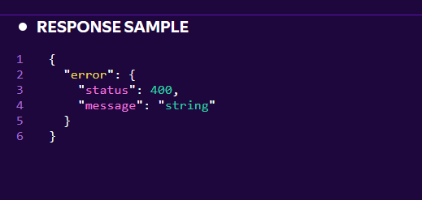
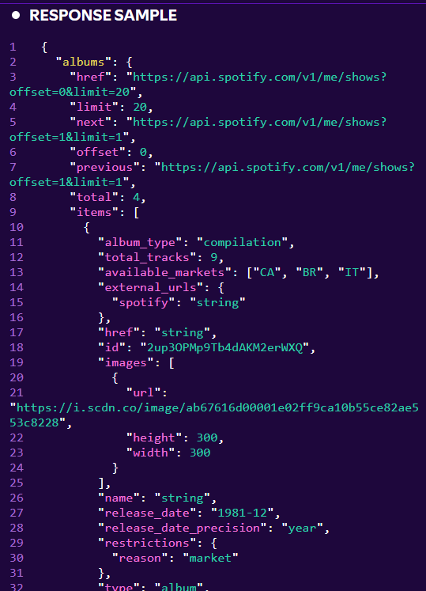

| API | URL | 05. Error response có cấu trúc | 06. Pagination rõ ràng |
| :--- | :--- | :--- | :--- |
| Get Album |GET /albums/{id} |Không|Có|
| Get Several Albums |GET /albums |Không|Có|
| Get Album Tracks |GET /albums/{id}/tracks|Không|Có|
| Get User's Saved Albums |GET /me/albums |Không|Có|
| Save Albums for Current User |PUT /me/albums |Không|-|
| Remove Users' Saved Albums |DELETE /me/albums |Không|-|
| Check User's Saved Albums |GET /me/albums/contains |Không|Có|
| Get New Releases |GET /browse/new-releases |Không|Có|

- Nhận xét: Các api có trả về error response nhưng cấu trúc chưa đầy đủ, chỉ có status và message
- VD:

- Pagination rõ ràng, ở đây chủ yếu dùng offset
- VD:
